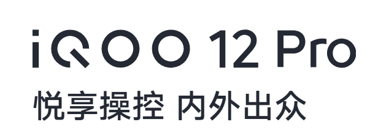

<!-- 本自述文档尚未完结，正在更新中… 
     本文档部分格式和模板灵感来源于高楷修先生GitHub@Lingggao，特此注明-->

***<div align=center><font color="00AAFF" size=6 face="黑体">```慢品人间烟火色，闲观万事岁月长```</font></div>***

***<div align=right><font color="00AAFF" size=6 face="黑体">```————苏轼```***[^苏轼]</font></div>
这里是饮料，一名刚刚从高考苦海渡劫出来又即将踏入大学的苦逼学生。我很喜欢上面苏轼的这句词，这句词陪伴了我大半个高三。人间烟火值得我去慢慢细品，生活中各种各样的事情也会带给我们成长和欢乐。坐观人生世间百态，何尝不是如此呢。

# 关于我 | Profile
---
<div align=center></div>

&emsp;&emsp;饮料，男，19岁，学生。来自山东淄博，现居北京，汉族，毕业于山东淄博实验中学，2020年12月加入中国共产主义青年团。Microsoft Windows Insider Program Member，曾参与书法教育教学，高中数学物理课程教学培训。独立原创音乐人，网易入驻歌手，腾讯校园音乐人。

&emsp;&emsp;本科现就读于华北科技学院计算机学院网络工程专业。曾获得省级文化艺术比赛书法类一等奖，市、区级文化艺术节各级别奖项[^各级别奖项]数十次。自幼学习声乐、书法已十余年，书法精通楷、隶、行等多种书体。擅长作词、作曲、演唱。2022年发布与他人共同演唱的原创作品，同年发布个人原创单曲专辑。曾参与开发、编辑vivo/iQOO第三方主题共享到v粉社区成员使用。喜欢中国铁路，淄博公交。

----
# 教育经历 | Education

**时间** | **学校** | **学历** | **地区**  
--- | --- | --- | ---
2024 年 09 月 - 至今 | 华北科技学院 | 本科 | 北京市
2021 年 09 月 - 2024 年 06 月 | 山东淄博实验中学 | 高中 | 淄博市
2017 年 09 月 - 2021 年 06 月 | 张店区东方实验学校 | 初中 | 张店区
2012 年 09 月 - 2017 年 07 月 | 张店区柳泉小学 | 小学 | 张店区

---
# 个人成就 | Achievement

## 证书 | Certificate

**机构** | **项目名称** | **获奖级别** | **证书编号** | **年份**  
--- | :---: | :---: | :---: | ---
中国书法家协会 | 社会艺术水平考级 | 软笔书法四级 | 119201800083566 | 2018
中华人民共和国教育部 | 书画等级考试 | 软笔书法六级 | 37061321111600051 | 2021
中央广播电视总台 | 全国艺术教育成果展演 | 软笔书法高中组一等奖 | ZM202110789 | 2021
中华人民共和国教育部 | 书画等级考试 | 软笔书法三级 | 37046419211300062 | 2020
文化部中国歌剧舞剧院 | 社会艺术水平考级 | 播音主持/朗诵 七级 | 0082015189250 | 2015
文化部中国歌剧舞剧院 | 社会艺术水平考级 | 播音主持/朗诵 五级 | 0082014260895 | 2014
文化部中国歌剧舞剧院 | 社会艺术水平考级 | 播音主持/朗诵 三级 | 0082013115057 | 2013


## 荣誉奖项 | Awards

**机构** | **项目** | **奖项** | **年份**
--- | :---: | :---: | :---:
**山东淄博实验中学** | **学生奖学金** | **励志奖** | **2023**
淄博市教育局 | 市级优秀学生评奖 | 淄博市三好学生 | 2019
张店区教育局 | 国学小名士 | 三等奖 | 2018
淄博市教育局 | 青少年科普系列活动 | 三等奖 | 2017
中国科普作家协会 | 生活中的数学征文活动 | 一等奖 | 2016
中国少儿书画院 | 第二届中国北京国际书画双年展 | 铜奖 | 2014
山东省书画学会 | HCA国际书画大赛 | 银奖 | -
... | ... | ... | ...

## 其他 | Other

### <font color="0050C0">腾讯校园音乐人</font>＆<font color="FF3000">网易音乐人</font>

**腾讯校园原创音乐人身份**，可以在[我的QQ音乐主页](https://c6.y.qq.com/base/fcgi-bin/u?__=XK0seSRy0ajm)查看
**网易音乐人身份**，可以在[我的网易云音乐主页](http://music.163.com/artist?id=53394400&userid=1520329510)查看

### 我的音乐作品

在2022年，与豆芽酱共同演唱《光线》，收录在专辑《是否》中。同年7月首发个人单曲《水墨的工笔变成写意》，收录在同名专辑中。<br/>
在全民K歌平台发布翻唱歌曲已近百首，点击查看[我的全民K歌主页](https://static-play.kg.qq.com/node/personal_v2?uid=649c9d872325308b34&shareUid=649c9d872325308b34&pageId=homepage_me)


**歌曲名称** | **专辑** | **演唱** | **发行年份** | **链接**
:---: | :---: | :---: | :---: | :---:
《光线》 | 《是否》 | 饮料/豆芽酱 | 2022 | [<font color="FF5000">网易云音乐</font><br/>《光线》](https://y.music.163.com/m/song?id=1915669283&userid=1520329510&dlt=0846)
《水墨的工笔变成写意》 | 《水墨的工笔变成写意》 | 饮料 | 2022 | [<font color="FF5000">网易云音乐</font>](https://y.music.163.com/m/song?id=1964826387&userid=1520329510&dlt=0846)<br/>[<font color="00FFAA">QQ音乐</font>](https://c6.y.qq.com/base/fcgi-bin/u?__=4sLnAJJy0hIv)
《晴天》 | — | 饮料 | 2024 | [<font color="00FFAA">QQ音乐<br/>(cover周杰伦)</font>](https://c6.y.qq.com/base/fcgi-bin/u?__=mYvaj2tj0Qxr)
《我的纸飞机》 | — | 饮料 | 2024 | [<font color="00FFAA">QQ音乐<br/>(cover王之睿/GooGoo)</font>](https://c6.y.qq.com/base/fcgi-bin/u?__=FiH0zPFj0ovI)
《白羊》 | — | 饮料 | 2024 | [抖音短视频<br/>(cover徐秉龙/沈以诚)](https://v.douyin.com/ihmGJCxH/)
《七里香》 | — | 饮料 | 2022 | [抖音短视频<br/>(cover周杰伦)](https://v.douyin.com/ihmGaqAN/)
... | ... | ... | ... | ...

### <font color="00AAFF">知乎</font>创作者

知乎数码科技领域创作者，多领域涉猎（ID：饮料小宝贝）曾有创作回答获得近100w阅读量，超6k点赞，1k收藏[^近100w阅读量，超6k点赞，1k收藏]。[我的知乎主页](https://www.zhihu.com/people/jiu-jiao-wo-yin-liao-ba)
<br/>

---

# 其他的浅谈

## 我的标签

Windows | Python | Java | C++
:---: | :---: | :---: | :---:
**Microsoft** | **Office** | **vivo** | **iQOO**
**Markdown** | **LaTeX** | 作曲 | 播音主持
**Android** | **Linux** | **R＆B** | 王者荣耀
林俊杰 | 周杰伦 | 中国铁路 | 公共交通
摄影 | K歌 | 钢琴 | 书法

## 你可以在哪里找到我

**平台** | **ID** | **用户名** | 
:---: | :---: | :---:
QQ | 2302029612 | 午夜心碎饮料
WeChat | YinLiao_ovo | 午夜心碎饮料
BiliBili | UID:485620143 | 午夜心碎饮料
知乎 | 饮料小宝贝 | —
X | YinLiao_Baby | Yin Liao
GitHub | YinLiao-ovo | 饮料
王者荣耀 | 新年限定饮料 | —
Microsoft Community | YinLiao.Liu | —
抖音 | YinLiao.ovo | 午夜心碎饮料
全民K歌 | lyl2302029612 | 午夜心碎饮料

## 我的设备

**设备类型** | **设备品牌/型号** | **内存** | **存储**
:---: | :---: | :---: | :---:
手机 |  | 12GB | 512GB
平板 | iPad 2021 | 4GB | 64GB
电脑 | HP Gaming Laptop 16 | 16GB | 1TB

---

[^各级别奖项]:详见【证书】【荣誉奖项】两栏 
[^苏轼]:出自苏轼所作《浣溪沙·慢品人间烟火色》
[^近100w阅读量，超6k点赞，1k收藏]:原回答链接:[假如你突然变成了猫娘，你会做什么](https://www.zhihu.com/question/609718303/answer/3161608162)
